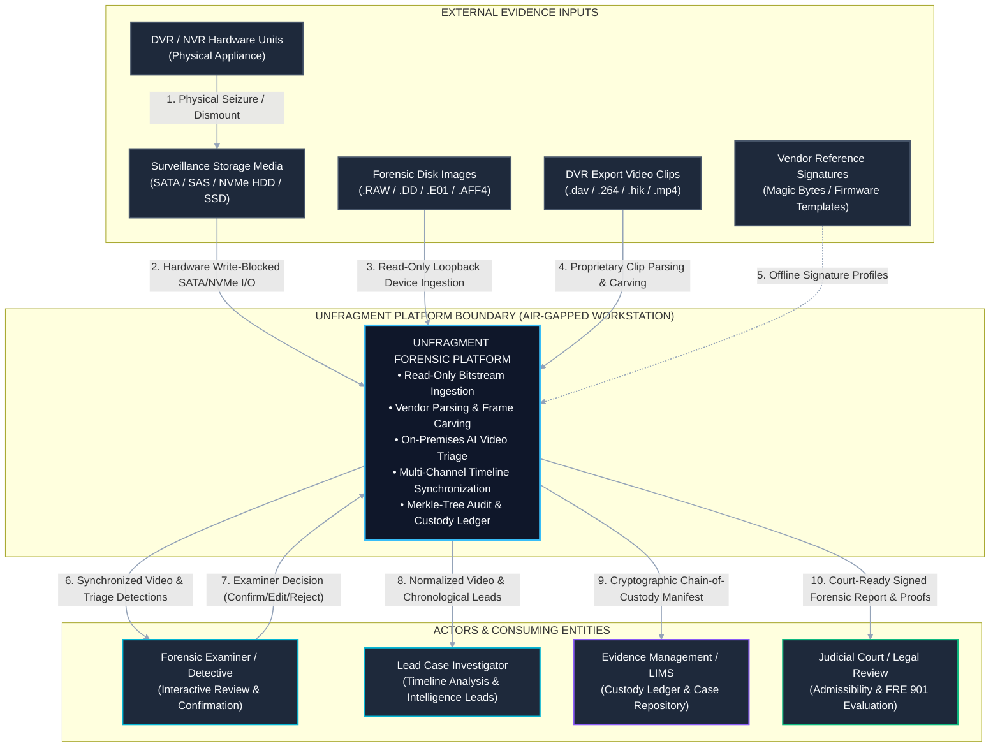

# 02 — System Context & Ecosystem
## How UNFRAGMENT Connects from Crime Scene to Courtroom

---

## 💡 In Plain English / For Non-Tech Readers

Think of UNFRAGMENT as a **high-tech forensic airlock**. When detectives seize a damaged or locked CCTV recorder from a bank robbery or crime scene, they cannot just plug it into their laptop. If they do, they risk destroying evidence or being accused of tampering.

UNFRAGMENT sits right in the middle:
1. It takes in the physical hard drive through a special **hardware write blocker** (like looking at a priceless artifact inside bulletproof museum glass without touching it).
2. It processes the video inside a secure, air-gapped forensic workstation (no internet access, completely offline).
3. It hands the detective a clean video player and a list of AI-detected events.
4. It hands the judge and lawyers a signed, tamper-proof legal certificate.

```
┌────────────────────────────────────────────────────────────────────────────────────────┐
│                     CRIME SCENE TO COURTROOM FORENSIC JOURNEY                          │
└────────────────────────────────────────────────────────────────────────────────────────┘

  [CRIME SCENE]          [SEIZURE & LOCK]         [UNFRAGMENT PLATFORM]        [LEGAL OUTCOME]
 ┌─────────────┐        ┌─────────────────┐      ┌──────────────────────┐     ┌──────────────┐
 │ Surveillance│  ───►  │ Physical Drive  │ ───► │  1. Write-Blocker In │───► │ Courtroom    │
 │ CCTV Camera │        │ in Tamper-Proof │      │  2. Deep Carving     │     │ Judge & Jury │
 │ & DVR Unit  │        │ Evidence Bag    │      │  3. AI Video Triage  │     │ Review Signed│
 └─────────────┘        └─────────────────┘      │  4. Examiner Review  │     │ Report & MP4 │
                                                 └──────────────────────┘     └──────────────┘
```

---

## 🌐 System Context Diagram (Mermaid)



---

## 🔒 Security Enclaves & Trust Boundaries

```
┌────────────────────────────────────────────────────────────────────────────────────────┐
│                        UNFRAGMENT TRUST BOUNDARIES & ENCLAVES                          │
└────────────────────────────────────────────────────────────────────────────────────────┘

 [ZONE 0: PHYSICAL SEIZURE AT CRIME SCENE]
      │
      ▼ (HARDWARE WRITE-BLOCKER BOUNDARY: Physical Wire-Level Isolation)
 ┌──────────────────────────────────────────────────────────────────────────────────────┐
 │ ZONE 1: READ-ONLY EVIDENCE ENCLAVE (Class A)                                         │
 │ • Physical Source Drives • Bit-by-Bit RAW/E01 Images • Dual SHA-256/MD5 Master Hashes│
 │ • Zero writes allowed. Host OS can only READ.                                        │
 └──────────────────────────────────────────────────────────────────────────────────────┘
      │
      ▼ (STREAM EXTRACTION BOUNDARY: Zero-Copy Block Parsing)
 ┌──────────────────────────────────────────────────────────────────────────────────────┐
 │ ZONE 2: RECOVERED STREAM REPOSITORY (Class B)                                        │
 │ • Extracted H.264/H.265 NAL Units • Reconstructed GOPs • Normalized Playable MP4/MKV │
 │ • Clean, playable video created from raw carved pieces.                              │
 └──────────────────────────────────────────────────────────────────────────────────────┘
      │
      ▼ (SANDBOXED DERIVATIVE BOUNDARY: Read-Only Video Pipe)
 ┌──────────────────────────────────────────────────────────────────────────────────────┐
 │ ZONE 3: AI TRIAGE SANDBOX (Class C)                                                  │
 │ • CV Object Detection • Person/Vehicle Classifier • Timeline Intelligence • LLM Draft│
 │ • Smart detections, strictly provisional. Never touches original evidence.           │
 └──────────────────────────────────────────────────────────────────────────────────────┘
      │
      ▼ (HUMAN EXAMINER AUTHORITY GATE: Affirmative Attestation)
 ┌──────────────────────────────────────────────────────────────────────────────────────┐
 │ ZONE 4: VERIFIED AUDIT & CASE LEDGER (Class D)                                       │
 │ • Human Confirm/Edit/Reject Decisions • Merkle Audit Chain • Signed Court Certificate│
 │ • 100% legal, court-admissible output signed by the human examiner.                  │
 └──────────────────────────────────────────────────────────────────────────────────────┘
```

---

## 📋 External Interface Specifications

| External Entity | Data Received by UNFRAGMENT | Data Output by UNFRAGMENT | Legal Safeguard |
| :--- | :--- | :--- | :--- |
| **Physical Hard Drive** | Raw sector bytes (LBA 0 to $N$) | NONE (Zero-write hardware lock) | ISO/IEC 27037 §7.3 |
| **Disk Image (.E01 / .RAW)** | Compressed or raw bitstream blocks | Verification status & hash | NIST SP 800-86 |
| **Forensic Detective** | Confirm / Edit / Reject decisions | Multi-channel video, bounding boxes | FRE 901 human authority |
| **Lead Investigator** | Investigation case parameters | Synchronized timeline of events | Actionable crime leads |
| **Judicial Court** | Defense/Prosecution audit queries | Signed PDF report + Merkle proofs | BSA 2023 Sec 63 certificate |

---

[← Previous: 01 — Executive Summary](./01_EXECUTIVE_SUMMARY_AND_PROBLEM.md) | [Master Index](./README.md) | [Next: 03 — Four-Layer Architecture →](./03_FOUR_LAYER_ARCHITECTURE.md)
