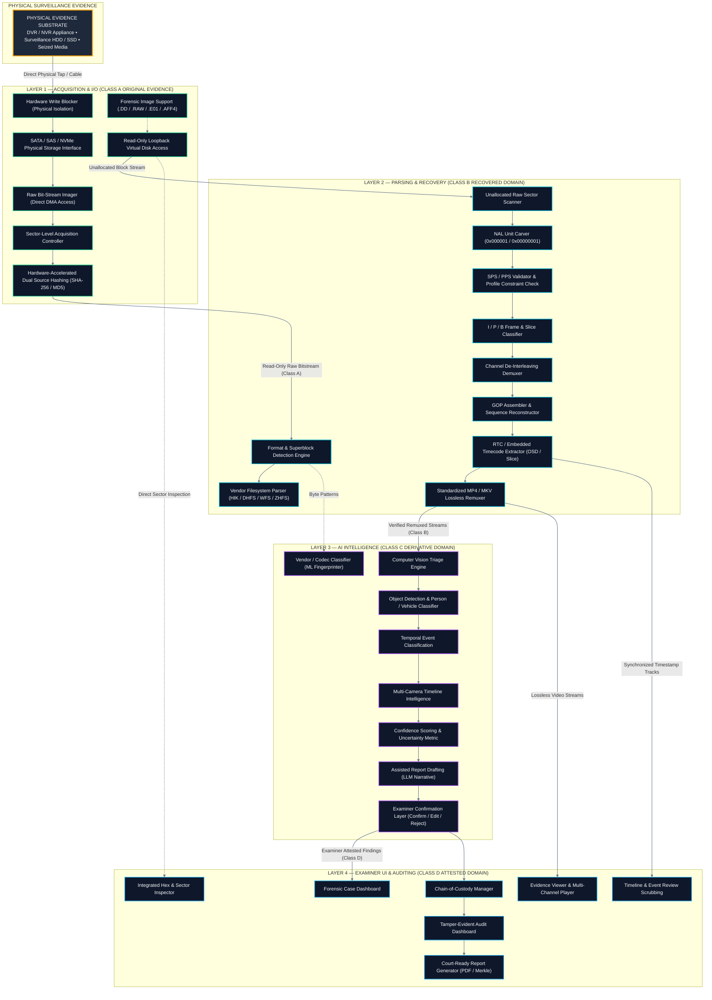

# 03 — Four-Layer Architecture
## The Core Architectural Separation of Concerns

---

## 💡 In Plain English / For Non-Tech Readers: The 4-Floor Forensic Skyscraper

Imagine UNFRAGMENT as a **secure 4-story forensic laboratory building**. Each floor has one job, and people are strictly prohibited from mixing duties:

```
┌────────────────────────────────────────────────────────────────────────────────────────┐
│                     THE 4-FLOOR FORENSIC SKYSCRAPER ANALOGY                            │
├────────────────────────────────────────────────────────────────────────────────────────┤
│                                                                                        │
│  FLOOR 4: THE COURTROOM & EXAMINER OFFICE                                              │
│  ┌──────────────────────────────────────────────────────────────────────────────────┐  │
│  │ The Detective and Lawyer lounge. Video playback on 16 screens, timeline scrubber,│  │
│  │ hex inspector, and official report generator.                                    │  │
│  └──────────────────────────────────────────────────────────────────────────────────┘  │
│                                    ▲                                                   │
│                                    │ Only verified human decisions pass up             │
│  FLOOR 3: THE AI INTELLIGENCE LAB  │                                                   │
│  ┌──────────────────────────────────────────────────────────────────────────────────┐  │
│  │ A smart, air-gapped assistant scans the video for people, cars, and events.      │  │
│  │ Everything is watermarked "AI-Generated — Unverified" until approved upstairs.   │  │
│  └──────────────────────────────────────────────────────────────────────────────────┘  │
│                                    ▲                                                   │
│                                    │ Reads playable MP4 video copies                   │
│  FLOOR 2: THE RECONSTRUCTION WORKSHOP                                                  │
│  ┌──────────────────────────────────────────────────────────────────────────────────┐  │
│  │ Master technicians reverse-engineer Hikvision and Dahua secret formats.          │  │
│  │ They carve raw video slices, assemble broken frames, and sync camera clocks.     │  │
│  └──────────────────────────────────────────────────────────────────────────────────┘  │
│                                    ▲                                                   │
│                                    │ Reads raw byte sectors through a one-way mirror   │
│  FLOOR 1: THE HIGH-SECURITY EVIDENCE VAULT                                             │
│  ┌──────────────────────────────────────────────────────────────────────────────────┐  │
│  │ Hardware Write-Blockers lock the drive in 100% read-only mode. Dual SHA-256 and  │  │
│  │ MD5 hashes are generated immediately. Not a single bit can be altered!          │  │
│  └──────────────────────────────────────────────────────────────────────────────────┘  │
│                                    ▲                                                   │
│                                    │ Connected via physical write-blocker cable        │
│  BASEMENT: THE SEIZED CRIME SCENE CCTV HARD DRIVE                                      │
│                                                                                        │
└────────────────────────────────────────────────────────────────────────────────────────┘
```

---

## 🏛️ Four-Layer Architecture Diagram (Mermaid)



---

## 🔍 Layer-by-Layer Technical Specification

### Layer 1: Acquisition & I/O
* **Mission:** Guaranteed read-only physical access. Zero byte modifications under any circumstance.
* **Key Components:**
  * **Hardware Write Blocker:** Physical isolation bridging SATA/NVMe connections. Drops write commands at the hardware register level.
  * **Direct DMA Imager:** Sector-by-sector copying (`O_DIRECT`) bypassing operating system cache.
  * **Dual Hashing Engine:** Parallel generation of SHA-256 and MD5 hashes at the moment of acquisition.

### Layer 2: Parsing & Recovery
* **Mission:** Crack open vendor formats and assemble broken video slices into playable MP4/MKV files.
* **Key Components:**
  * **Vendor Filesystem Parsers:** Native decoding for Hikvision (HIK), Dahua (DHFS 4.1), and Jovision (WFS 0.4).
  * **Deep NAL Unit Carver:** Hunts for H.264/H.265 byte markers (`00 00 01` and `00 00 00 01`) across unallocated space.
  * **Channel De-Interleaver:** Disentangles multiplexed camera slices so Camera 1 video does not show up in Camera 2.
  * **RTC Time Synchronizer:** Reads camera hardware clock timestamps from slice headers to eliminate time drift.

### Layer 3: AI Intelligence
* **Mission:** Fast-forward investigations by finding people, cars, and events in minutes.
* **Key Components:**
  * **Local YOLOv8 Computer Vision:** Quantized on-device object detection running 100% offline.
  * **Multi-Camera Timeline Intelligence:** Correlates suspect movements across multiple cameras.
  * **Local LLM Case Drafter:** Generates an objective draft timeline narrative for the detective to review.
  * **Safety Isolation:** Everything produced here is strictly labeled *"AI-Generated — Unverified"*.

### Layer 4: Examiner UI & Auditing
* **Mission:** The command center for the licensed detective and judicial certification.
* **Key Components:**
  * **16-Channel Video Player:** Smooth, synchronized playback of multiple camera angles.
  * **Hex Inspector:** Click any video frame and see the exact physical disk sector where it lives.
  * **Confirm / Edit / Reject Gate:** The detective makes every final decision.
  * **Merkle Tree Audit Ledger:** Produces court-ready, signed PDF certificates compliant with ISO/IEC 27037 and Section 63 BSA 2023.

---

[← Previous: 02 — System Context](./02_SYSTEM_CONTEXT_AND_ECOSYSTEM.md) | [Master Index](./README.md) | [Next: 04 — Components & Plugin Engine →](./04_COMPONENTS_AND_PLUGIN_ENGINE.md)
