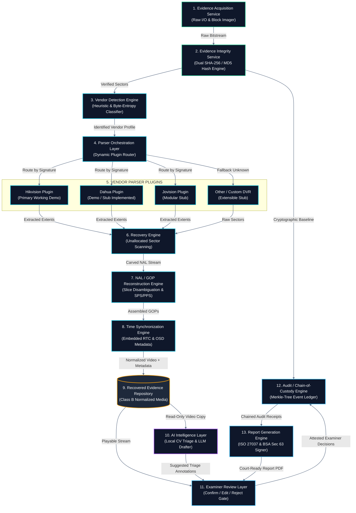
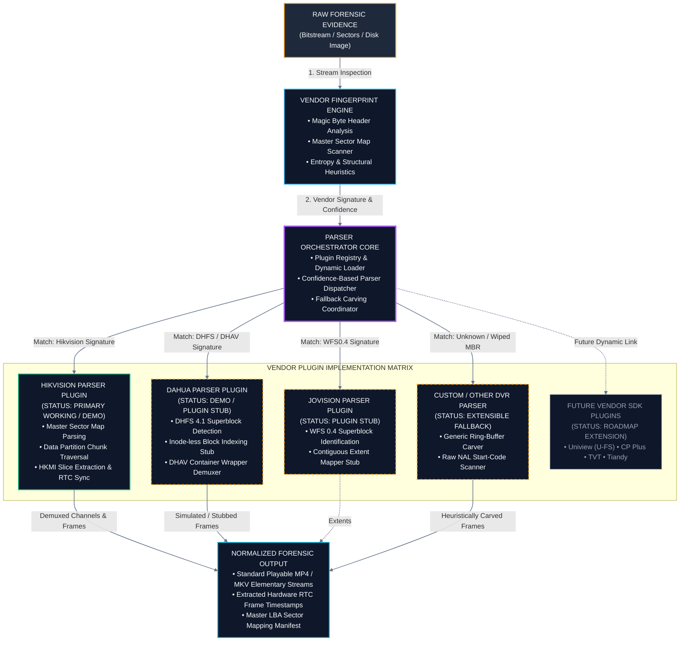

# 04 — Components & Plugin Engine
## The 13 Subsystems & The Universal Multi-Vendor Adapter

---

## 💡 In Plain English / For Non-Tech Readers: The Universal Travel Adapter

Imagine you travel across Europe, the UK, the US, and India. Every country has a completely different wall outlet. If you try to force a UK plug into a US socket, you break the socket or cause a short circuit.

CCTV DVRs are the same. A Hikvision hard drive uses one secret format, a Dahua hard drive uses another, and Jovision uses a third. 

```
┌────────────────────────────────────────────────────────────────────────────────────────┐
│                        THE UNIVERSAL DVR ADAPTER CONCEPT                               │
├────────────────────────────────────────────────────────────────────────────────────────┤
│                                                                                        │
│   DIFFERENT CCTV VENDORS                  UNFRAGMENT AUTO-DETECTION & PLUGINS          │
│                                                                                        │
│  ┌───────────────────────┐                 ┌────────────────────────────────────────┐  │
│  │ HIKVISION HARD DRIVE  │───► [Socket A]──►│ HIKVISION PARSER PLUGIN (WORKING DEMO) │  │
│  │ (Master Sector Maps)  │                 │  Reads proprietary HKMI frame wrappers │  │
│  └───────────────────────┘                 └───────────────────┬────────────────────┘  │
│                                                                │                       │
│  ┌───────────────────────┐                 ┌───────────────────┴────────────────────┐  │
│  │ DAHUA HARD DRIVE      │───► [Socket B]──►│ DAHUA PARSER PLUGIN (DEMO STUB)       │  │
│  │ (DHFS 4.1 Superblock) │                 │  Recognizes DHAV video containers      │  │
│  └───────────────────────┘                 └───────────────────┬────────────────────┘  │
│                                                                │                       │
│  ┌───────────────────────┐                 ┌───────────────────┴────────────────────┐  │
│  │ OTHER / UNKNOWN CCTV  │───► [Unknown ]──►│ RAW NAL STREAM CARVER (FALLBACK)       │  │
│  │ (Zeroed or Broken MBR)│                 │  Direct search for 0x000001 byte codes │  │
│  └───────────────────────┘                 └───────────────────┬────────────────────┘  │
│                                                                │                       │
│                                                                ▼                       │
│                                            ┌────────────────────────────────────────┐  │
│                                            │ NORMALIZED, CRYSTAL-CLEAR MP4 VIDEO    │  │
│                                            │ Plays in any media player immediately! │  │
│                                            └────────────────────────────────────────┘  │
│                                                                                        │
└────────────────────────────────────────────────────────────────────────────────────────┘
```

UNFRAGMENT acts as a **Universal Forensic Adapter**. It scans the first few sectors of the disk, identifies the manufacturer's unique "fingerprint," and automatically clicks the right parser plugin into place. If the format is completely unknown or the disk was formatted to hide a crime, UNFRAGMENT falls back to **Raw NAL Stream Carving**, extracting video frames directly from raw sectors.

---

## ⚙️ Component Architecture Pipeline (Mermaid)



---

## 🔌 Multi-Vendor Plugin Architecture (Mermaid)



---

## 💻 The Plugin Interface Contract

Every vendor parser implements the clean `BaseParserPlugin` programming interface:

```python
class BaseParserPlugin(ABC):
    """Standard interface that all DVR vendor plugins implement."""

    @abstractmethod
    def identify(self, sector_buffer: bytes) -> IdentificationResult:
        """Checks sector bytes for vendor magic signatures and returns confidence (0.0 to 1.0)."""
        pass

    @abstractmethod
    def parse_filesystem_geometry(self, disk_handle: BinaryIO) -> FilesystemGeometry:
        """Decodes master allocation tables, partition offsets, and ring-buffer extents."""
        pass

    @abstractmethod
    def enumerate_channels(self) -> List[ChannelDescriptor]:
        """Finds all multiplexed cameras (e.g. Camera 1 through Camera 16)."""
        pass

    @abstractmethod
    def extract_stream(self, channel_id: int, time_range: TimeRange) -> Iterator[ForensicFrame]:
        """Yields reconstructed video frames with physical sector offsets and real-time clock timestamps."""
        pass
```

### Forensic Implementation Status
* **Hikvision (Primary Working Demo):** Full reverse-engineering completed. Reads Master Sector Maps, unpacks 256 MB data blocks, extracts `HKMI` frame slices, pulls embedded hardware timestamps, and produces clean MP4 files.
* **Dahua (Demo / Plugin Stub):** Fully structured stub. Detects `DHFS 4.1` superblocks and recognizes `DHAV` container wrappers. Demonstrates how new vendor plugins plug into the orchestrator without touching core code.
* **Jovision & Generic Carving (Extensible Fallback):** When headers are completely erased or unknown, the engine scans for raw H.264/H.265 byte markers (`00 00 01`), reassembling frames even without filesystem tables!

---

[← Previous: 03 — Four-Layer Architecture](./03_FOUR_LAYER_ARCHITECTURE.md) | [Master Index](./README.md) | [Next: 05 — Workflow & Evidence Data Flow →](./05_WORKFLOW_AND_EVIDENCE_DATA_FLOW.md)
