# 05 — Workflow & Evidence Data Flow
## The 16-Stage Forensic Lifecycle & The Glass Vault Model

---

## 💡 In Plain English / For Non-Tech Readers: The Glass Vault Analogy

In criminal law, you cannot bring a video to court if anyone could have touched or modified it. Defense attorneys will ask: *"How do we know your AI didn't add that suspect into the video?"*

UNFRAGMENT solves this with **The Glass Museum Vault Model**:

```
┌────────────────────────────────────────────────────────────────────────────────────────┐
│                        THE GLASS VAULT EVIDENCE ISOLATION MODEL                        │
├────────────────────────────────────────────────────────────────────────────────────────┤
│                                                                                        │
│  [THE UNTOUCHABLE VAULT: CLASS A]          [THE WORKSHOP: CLASS B]                     │
│  ┌─────────────────────────────────┐       ┌─────────────────────────────────────┐     │
│  │ ORIGINAL PHYSICAL DVR HARD DISK │       │ RECONSTRUCTED WORKING COPY          │     │
│  │ • Locked by Hardware Blocker    │ ────► │ • Standard playable MP4 video files │     │
│  │ • Master SHA-256 & MD5 Hashes   │       │ • Every frame linked to disk sector │     │
│  │ • NO ONE CAN WRITE OR EDIT!     │       │ • Used for detective playback       │     │
│  └─────────────────────────────────┘       └──────────────────┬──────────────────┘     │
│                                                               │                        │
│                                                               ▼                        │
│  [THE ATTESTED COURT RECORD: CLASS D]      [THE AI SANDBOX: CLASS C]                   │
│  ┌─────────────────────────────────┐       ┌─────────────────────────────────────┐     │
│  │ COURT-READY SIGNED REPORT       │       │ PROVISIONAL AI NOTES & TAGS         │     │
│  │ • Merkle-Tree Hash Proofs       │ ◄──── │ • Bounding boxes & draft text       │     │
│  │ • Human Detective Signature     │ (Only │ • Watermark: AI-Generated/Unverified│     │
│  │ • 100% legally binding evidence │ if    │ • Completely separate metadata      │     │
│  │ • Admissible under BSA Sec 63   │ human │ • If deleted, video is unchanged!   │     │
│  └─────────────────────────────────┘ signs)└─────────────────────────────────────┘     │
│                                                                                        │
└────────────────────────────────────────────────────────────────────────────────────────┘
```

1. **Original Evidence (Class A):** Locked in a bulletproof glass vault. Zero writes permitted.
2. **Recovered Video (Class B):** A verified working copy of the footage converted to clean MP4.
3. **AI Detections (Class C):** Think of these as sticky notes placed on the outside of the glass. They do not alter the video.
4. **Court Record (Class D):** Only when the human detective confirms a sticky note does it get stamped with an unhackable cryptographic seal and entered into the judicial case file!

---

## 🗺️ The 16-Stage End-to-End Investigation Roadmap

```
  [01: IDENTIFICATION]  ──► [02: WRITE-BLOCK]     ──► [03: DUAL HASH]       ──► [04: VENDOR FINGERPRINT]
    Drive Serial & Case       Physical Cable Lock        SHA-256 / MD5 Stamp       Detect Hik/Dahua/Etc.
            │                                                                              │
            ▼                                                                              ▼
  [08: GOP REBUILD]     ◄── [07: NAL DETECTION]   ◄── [06: RAW SECTOR SCAN] ◄── [05: FILESYSTEM PARSE]
    Assemble I/P Frames       Hunt 0x000001 codes        Unallocated Cluster Scan   Extract Sector Tables
            │
            ▼
  [09: DE-INTERLEAVE]   ──► [10: RTC TIME SYNC]   ──► [11: MP4 EXPORT]      ──► [12: AI VIDEO TRIAGE]
    Separate 16 Cameras       Sync Camera Clocks         Lossless Normalized MP4    Local Person/Car Search
                                                                                           │
                                                                                           ▼
  [16: COURT REPORT]    ◄── [15: CHAIN OF CUSTODY]◄── [14: CRYPTO AUDIT]    ◄── [13: EXAMINER REVIEW]
    Signed Legal PDF          Merkle Tree Chaining       Sector Traceability Proof  Confirm/Edit/Reject
```

---

## 📊 End-to-End Workflow Diagram (Mermaid)

```mermaid
flowchart LR
    %% Styling Definitions
    classDef stgAcq fill:#0f172a,stroke:#10b981,stroke-width:2px,color:#f8fafc;
    classDef stgPars fill:#0f172a,stroke:#06b6d4,stroke-width:2px,color:#f8fafc;
    classDef stgCarv fill:#0f172a,stroke:#38bdf8,stroke-width:2px,color:#f8fafc;
    classDef stgAI fill:#0f172a,stroke:#a855f7,stroke-width:2px,color:#f8fafc;
    classDef stgRev fill:#0f172a,stroke:#f59e0b,stroke-width:2px,color:#f8fafc;
    classDef stgLegal fill:#0f172a,stroke:#ec4899,stroke-width:2px,color:#f8fafc;

    subgraph PHASE_1 ["PHASE I: INGESTION & INTEGRITY"]
        direction TB
        S01["01<br/>EVIDENCE<br/>IDENTIFICATION"]:::stgAcq
        S02["02<br/>WRITE-PROTECTED<br/>ACQUISITION"]:::stgAcq
        S03["03<br/>HASH<br/>GENERATION"]:::stgAcq
    end

    subgraph PHASE_2 ["PHASE II: PARSING & DISCOVERY"]
        direction TB
        S04["04<br/>VENDOR / CODEC<br/>FINGERPRINTING"]:::stgPars
        S05["05<br/>FILESYSTEM / FORMAT<br/>ANALYSIS"]:::stgPars
        S06["06<br/>RAW SECTOR<br/>SCANNING"]:::stgPars
    end

    subgraph PHASE_3 ["PHASE III: STREAM CARVING & RECOVERY"]
        direction TB
        S07["07<br/>NAL UNIT<br/>DETECTION"]:::stgCarv
        S08["08<br/>FRAME / GOP<br/>RECONSTRUCTION"]:::stgCarv
        S09["09<br/>CHANNEL<br/>DE-INTERLEAVING"]:::stgCarv
        S10["10<br/>TIMECODE / RTC<br/>SYNCHRONIZATION"]:::stgCarv
        S11["11<br/>RECOVERED VIDEO<br/>GENERATION"]:::stgCarv
    end

    subgraph PHASE_4 ["PHASE IV: INTELLIGENCE & TRIAGE"]
        direction TB
        S12["12<br/>AI VIDEO<br/>TRIAGE"]:::stgAI
        S13["13<br/>EXAMINER<br/>REVIEW"]:::stgRev
    end

    subgraph PHASE_5 ["PHASE V: LEGAL ATTESTATION"]
        direction TB
        S14["14<br/>CRYPTOGRAPHIC<br/>VERIFICATION"]:::stgLegal
        S15["15<br/>CHAIN OF<br/>CUSTODY"]:::stgLegal
        S16["16<br/>FORENSIC<br/>REPORT"]:::stgLegal
    end

    S01 --> S02 --> S03
    S03 ==> S04 --> S05 --> S06
    S06 ==> S07 --> S08 --> S09 --> S10 --> S11
    S11 ==> S12 --> S13
    S13 ==> S14 --> S15 --> S16

    linkStyle default stroke:#64748b,stroke-width:1.5px;
```



---

## 🔀 Forensic Data Flow Diagram (Mermaid)

```mermaid
flowchart TD
    %% Global Styling Definitions
    classDef origClass fill:#0f172a,stroke:#10b981,stroke-width:3px,color:#f8fafc;
    classDef recovClass fill:#0f172a,stroke:#06b6d4,stroke-width:2px,color:#f8fafc;
    classDef derivClass fill:#0f172a,stroke:#a855f7,stroke-width:2px,color:#f8fafc;
    classDef auditClass fill:#0f172a,stroke:#38bdf8,stroke-width:2px,color:#f8fafc;

    subgraph BOUND_ORIG ["ORIGINAL EVIDENCE BOUNDARY (STRICT READ-ONLY ENCLAVE — CLASS A)"]
        direction TB
        D1["PHYSICAL DVR STORAGE<br/>(Physical Media)"]:::origClass
        D2["RAW BITSTREAM<br/>(Direct Read DMA Stream)"]:::origClass
        D3["FORENSIC IMAGE<br/>(.RAW / .E01 / .AFF4 Image File)"]:::origClass
        D4["HASHED EVIDENCE<br/>(Dual SHA-256 & MD5 Manifest)"]:::origClass
        D5["RAW SECTORS<br/>(Block Range LBA 0 .. N)"]:::origClass
    end

    subgraph BOUND_RECOV ["RECOVERED EVIDENCE BOUNDARY (NORMALIZED MEDIA — CLASS B)"]
        direction TB
        D6["DETECTED NAL UNITS<br/>(H.264 / H.265 Start Slices)"]:::recovClass
        D7["RECONSTRUCTED STREAM<br/>(Assembled GOPs & De-Interleaved Slices)"]:::recovClass
        D8["RECOVERED VIDEO<br/>(Standard Normalized MP4 / MKV)"]:::recovClass
    end

    subgraph BOUND_DERIV ["DERIVATIVE AI PROCESSING BOUNDARY (SANDBOXED — CLASS C)"]
        direction TB
        D9["DERIVATIVE AI COPY<br/>(Read-Only Hash-Linked Scratch File)"]:::derivClass
        D10["AI EVENTS / METADATA<br/>(Bounding Boxes, Person/Car Labels, Draft Text)"]:::derivClass
    end

    subgraph BOUND_AUDIT ["VERIFIED CASE & AUDIT BOUNDARY (ATTESTED — CLASS D)"]
        direction TB
        D11["EXAMINER-VERIFIED FINDINGS<br/>(Confirmed / Edited / Rejected Annotations)"]:::auditClass
        D12["SIGNED AUDIT RECORD<br/>(Merkle-Tree Chained Receipts)"]:::auditClass
        D13["FORENSIC REPORT<br/>(Court-Ready Signed PDF Certificate)"]:::auditClass
    end

    D1 ==>|"Hardware Write Blocker Tap"| D2
    D2 ==>|"Bit-by-Bit Bitstream Acquisition"| D3
    D3 ==>|"Simultaneous Dual Hashing"| D4
    D4 ==>|"Immutable Direct Sector Reading"| D5

    D5 -->|"Start-Code Signature Carving"| D6
    D6 -->|"GOP Re-Assembly & Time Sync"| D7
    D7 -->|"Lossless Container Remuxing"| D8

    D8 -.->|"Zero-Write Loopback Pipe"| D9
    D9 -->|"On-Device CV / Local LLM Inference"| D10

    D10 ==>|"Examiner Interactive Verification Gate"| D11
    D11 -->|"Cryptographic Event Anchoring"| D12
    D12 -->|"Final Case Compilation"| D13

    linkStyle default stroke:#64748b,stroke-width:1.5px;
```



---

[← Previous: 04 — Components & Plugins](./04_COMPONENTS_AND_PLUGIN_ENGINE.md) | [Master Index](./README.md) | [Next: 06 — AI Integration & Human Oversight →](./06_AI_INTEGRATION_AND_HUMAN_OVERSIGHT.md)
