# 06 — AI Integration & Human Oversight
## Computer Vision Triage, LLM Reporting & The Human Decision Gate

---

## 💡 In Plain English / For Non-Tech Readers: The AI Intern Metaphor

Imagine a senior homicide detective investigating a case with 500 hours of CCTV. If the detective has to watch every second alone, the investigation will take months.

Now imagine the detective has a **super-fast junior intern** sitting next to them:
* The intern watches 16 screens simultaneously in fast-forward.
* Whenever a red car appears, or someone climbs a fence, the intern places a sticky note on the desk: *"Detective, check Camera 4 at 02:14 AM — red vehicle spotted."*
* **The Crucial Legal Rule:** The intern **cannot** testify in court. The intern's sticky note is NOT evidence. The detective must look at the video, verify the car with their own eyes, and sign their name.

```
┌────────────────────────────────────────────────────────────────────────────────────────┐
│                   UNFRAGMENT DETECTIVE WORKSPACE & REVIEW GATE                         │
├────────────────────────────────────────────────────────────────────────────────────────┤
│ [CASE #2026-NTRO-150]  [EVIDENCE: HIKVISION-4TB-DRIVE]  [AIR-GAP STATUS: OFFLINE 🔒]   │
│ ┌───────────────────────────────────────┬────────────────────────────────────────────┐ │
│ │ CAM 01 - MAIN GATE       [02:14:12 AM]│ CAM 02 - PARKING REAR         [02:14:12 AM]│ │
│ │ ┌───────────────────────────────────┐ │ ┌────────────────────────────────────────┐ │ │
│ │ │                                   │ │ │          ┌──────────────┐              │ │ │
│ │ │                                   │ │ │          │ [PERSON] 94% │              │ │ │
│ │ │                                   │ │ │          │ SUSPECT HOOD │              │ │ │
│ │ │                                   │ │ │          └──────────────┘              │ │ │
│ │ └───────────────────────────────────┘ │ └────────────────────────────────────────┘ │ │
│ ├───────────────────────────────────────┴────────────────────────────────────────────┤ │
│ │ 🤖 AI TRIAGE SUGGESTION #42: Person detected climbing perimeter fence (Cam 02).    │ │
│ │    Confidence: 94.2%  |  Status: AI-GENERATED — UNVERIFIED                         │ │
│ │                                                                                    │ │
│ │    EXAMINER DECISION:                                                              │ │
│ │    [ ✅ CONFIRM AS EVIDENCE ]      [ ✏️ EDIT TAG / BOUNDS ]     [ ❌ REJECT / PURGE ]│ │
│ └────────────────────────────────────────────────────────────────────────────────────┘ │
└────────────────────────────────────────────────────────────────────────────────────────┘
```

In UNFRAGMENT:
* The AI **never edits or re-encodes video**.
* Every AI suggestion is watermarked **`AI-GENERATED — UNVERIFIED`**.
* The licensed detective has three buttons: **CONFIRM**, **EDIT**, or **REJECT**.
* If the detective rejects it, it is purged. If they confirm it, it is signed with their cryptographic key!

---

## 🤖 AI Integration & Review Gate Diagram (Mermaid)

```mermaid
flowchart TD
    %% Styling Classes
    classDef videoIn fill:#0f172a,stroke:#06b6d4,stroke-width:2px,color:#f8fafc;
    classDef aiBox fill:#0f172a,stroke:#a855f7,stroke-width:3px,color:#f8fafc;
    classDef aiFind fill:#1e293b,stroke:#a855f7,stroke-dasharray: 5 5,stroke-width:2px,color:#f8fafc;
    classDef examRev fill:#0f172a,stroke:#f59e0b,stroke-width:3px,color:#f8fafc;
    classDef decision fill:#0f172a,stroke:#38bdf8,stroke-width:2px,color:#f8fafc;
    classDef metaOut fill:#0f172a,stroke:#10b981,stroke-width:2px,color:#f8fafc;

    V_REC["RECOVERED HASH-VERIFIED VIDEO<br/>(Playable MP4 / MKV — Class B)"]:::videoIn
    V_COPY["AI PROCESSING COPY<br/>(Read-Only Ephemeral RAM Buffer)"]:::videoIn

    subgraph AI_BOX ["AI INTELLIGENCE LAYER (LOCAL AIR-GAPPED INFERENCE)"]
        direction TB
        M_CLASS["1. Vendor / Codec Classification"]
        M_OBJ["2. Object Detection (YOLOv8)"]
        M_PERS["3. Person Detection & Tracking"]
        M_VEH["4. Vehicle & License Plate Detection"]
        M_EVT["5. Temporal Event Classification"]
        M_CONF["6. Confidence Scoring & Uncertainty"]
        M_TIME["7. Multi-Channel Timeline Analysis"]
        M_LLM["8. Assisted Report Drafting (Local LLM)"]
    end
    style AI_BOX fill:#0f172a,stroke:#a855f7,stroke-width:2px;

    FINDINGS["AI FINDINGS & PROVISIONAL ANNOTATIONS<br/>• Bounding Boxes • Timestamps • Draft Narrative<br/>(WATERMARK: AI-GENERATED - UNVERIFIED)"]:::aiFind

    EXAM_GATE["EXAMINER REVIEW WORKSPACE<br/>(Human Examiner Authority Gate)"]:::examRev

    subgraph DECISION_BLOCK ["EXAMINER DECISION GATE"]
        D_CONF["CONFIRM<br/>(Accept AI Finding)"]:::decision
        D_EDIT["EDIT<br/>(Modify Bounding / Label)"]:::decision
        D_REJ["REJECT<br/>(Discard Finding)"]:::decision
    end

    META_VER["VERIFIED FORENSIC METADATA<br/>(Attested Case Record — Class D)<br/>• Examiner ID • Timestamp • Digital Signature"]:::metaOut

    V_REC ==>|"Zero-Copy DMA Stream"| V_COPY
    V_COPY --> AI_BOX
    AI_BOX --> FINDINGS
    FINDINGS ==>|"Present in Triage Queue"| EXAM_GATE
    EXAM_GATE --> DECISION_BLOCK

    D_CONF ==>|"Countersign"| META_VER
    D_EDIT ==>|"Adjust & Sign"| META_VER
    D_REJ ==>|"Audit & Purge"| META_VER

    linkStyle default stroke:#64748b,stroke-width:1.5px;
```



---

## 🛡️ Three Ironclad Legal Safeguards

### 1. Mandatory Software Watermark
Until an examiner clicks **Confirm**, every AI suggestion carries a mandatory system watermark:
> **"AI-GENERATED — UNVERIFIED METADATA"**  
This watermark cannot be bypassed by any user. It prevents unverified computer-vision tags from accidentally leaking into a legal court submission.

### 2. Zero Silent Automation
No AI finding is automatically saved into the final case file. If a detective ignores an AI notification, the system automatically flags it in the audit log as:
`UNREVIEWED_AI_TAG: NOT_ADMITTED_INTO_EVIDENCE`.

### 3. Model Weight Provenance Logging
In high-profile criminal trials, defense lawyers can demand to inspect the AI model. UNFRAGMENT logs:
* The exact SHA-256 hash of the neural network weights.
* The model version (e.g. `YOLOv8-nano-cctv-v2.1`).
* The exact confidence threshold and math parameters.  
This satisfies the strict legal discovery rules of **FRE 901(b)(9)** and **Section 63 BSA 2023**.

---

[← Previous: 05 — Workflow & Data Flow](./05_WORKFLOW_AND_EVIDENCE_DATA_FLOW.md) | [Master Index](./README.md) | [Next: 07 — Integrity, Security & Chain of Custody →](./07_INTEGRITY_SECURITY_AND_CHAIN_OF_CUSTODY.md)
