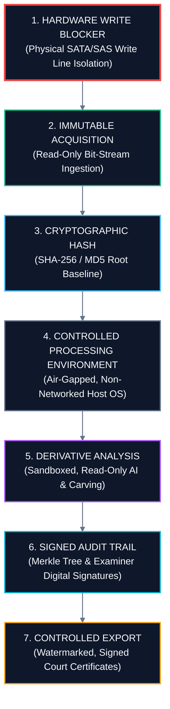

# 07 — Integrity, Security & Chain of Custody
## Cryptographic Hashing, The Merkle Tree Ledger & Legal Admissibility

---

## 💡 In Plain English / For Non-Tech Readers: The Digital Wax Seal

In ancient times, royal messengers melted red wax over letter envelopes and stamped it with the King’s signet ring. If someone opened the envelope to read or change the message, the wax cracked. When the envelope arrived in court, the judge could see whether the wax was broken.

In digital forensics, **Cryptographic Hashing (SHA-256)** is our digital wax seal.

```
┌────────────────────────────────────────────────────────────────────────────────────────┐
│                        THE DIGITAL TAMPER-PROOF WAX SEAL                               │
├────────────────────────────────────────────────────────────────────────────────────────┤
│                                                                                        │
│  ORIGINAL CRIME SCENE CCTV DRIVE                      CALCULATED SHA-256 DIGITAL SEAL  │
│  ┌────────────────────────────────────────┐          ┌──────────────────────────────┐  │
│  │ 4,000,000,000,000 bytes of raw data    │ ───────► │ 9f4ab281c7e289f...3e01a88b   │  │
│  │ Exactly as seized at the crime scene   │          │ (64-character unhackable ID) │  │
│  └────────────────────────────────────────┘          └──────────────────────────────┘  │
│                                                                      ▲                 │
│                                                                      │                 │
│  IF A DEFENSE LAWYER OR BAD ACTOR CHANGES EVEN ONE PIXEL:            │                 │
│  ┌────────────────────────────────────────┐          ┌───────────────┴──────────────┐  │
│  │ 4,000,000,000,000 bytes                │ ───────► │ e10952d77a01b...99ca4402     │  │
│  │ BUT ONE PIXEL WAS MODIFIED!            │          │ 💥 COMPLETELY DIFFERENT HASH! │  │
│  └────────────────────────────────────────┘          │ ❌ COURT IMMEDIATELY WARNED! │  │
│                                                      └──────────────────────────────┘  │
│                                                                                        │
└────────────────────────────────────────────────────────────────────────────────────────┘
```

### The Merkle Tree: A Chain of Sealed Envelopes
Every time the detective does something — acquires the disk, parses a camera, reviews an AI finding, or signs a note — UNFRAGMENT links these actions into a **Merkle Tree**. Think of this as a blockchain-style chain of custody. If anyone tries to alter a single timestamp or delete an examiner note 6 months later, the whole tree collapses!

```
                        ┌───────────────────────────────┐
                        │       MERKLE ROOT HASH        │
                        │        [0x9F4A...B281]        │
                        │    (Stamped on Final PDF)     │
                        └───────────────┬───────────────┘
                                        │
                ┌───────────────────────┴───────────────────────┐
                │                                               │
        ┌───────┴───────┐                               ┌───────┴───────┐
        │  NODE H(0,1)  │                               │  NODE H(2,3)  │
        └───────┬───────┘                               └───────┬───────┘
                │                                               │
        ┌───────┴───────┐                               ┌───────┴───────┐
        │               │                               │               │
  ┌─────┴─────┐   ┌─────┴─────┐                   ┌─────┴─────┐   ┌─────┴─────┐
  │  LEAF L0  │   │  LEAF L1  │                   │  LEAF L2  │   │  LEAF L3  │
  │Acquisition│   │Dual Hashing│                  │AI Triage  │   │Examiner Sig│
  │Baseline   │   │SHA256/MD5  │                  │YOLO Weights│  │Ed25519 Key │
  └───────────┘   └───────────┘                   └───────────┘   └───────────┘
```

---

## 🔗 Chain-of-Custody Architecture (Mermaid)

```mermaid
flowchart TD
    %% Styling Classes
    classDef acqStep fill:#0f172a,stroke:#10b981,stroke-width:2px,color:#f8fafc;
    classDef hashStep fill:#0f172a,stroke:#38bdf8,stroke-width:2px,color:#f8fafc;
    classDef idStep fill:#0f172a,stroke:#06b6d4,stroke-width:2px,color:#f8fafc;
    classDef procStep fill:#0f172a,stroke:#64748b,stroke-width:2px,color:#f8fafc;
    classDef aiStep fill:#0f172a,stroke:#a855f7,stroke-width:2px,color:#f8fafc;
    classDef examStep fill:#0f172a,stroke:#f59e0b,stroke-width:2px,color:#f8fafc;
    classDef sigStep fill:#0f172a,stroke:#ec4899,stroke-width:2px,color:#f8fafc;
    classDef merkleStep fill:#0f172a,stroke:#3b82f6,stroke-width:3px,color:#f8fafc;
    classDef repStep fill:#0f172a,stroke:#10b981,stroke-width:3px,color:#f8fafc;

    C01["1. EVIDENCE ACQUISITION<br/>(Physical Drive Seizure & Imaging)"]:::acqStep
    C02["2. DUAL HASH BASELINE<br/>(SHA-256 & MD5 Generated)"]:::hashStep
    C03["3. UNIQUE EVIDENCE IDENTIFIER<br/>(UUIDv5 Case / Item Namespace)"]:::idStep
    C04["4. PROCESSING EVENT<br/>(Parser & Carving Execution)"]:::procStep
    C05["5. HASH VERIFICATION<br/>(Pre/Post Execution Integrity Match)"]:::hashStep
    C06["6. AI PROCESSING EVENT<br/>(Model Weights Hash & Version Logged)"]:::aiStep
    C07["7. EXAMINER ACTION<br/>(Confirm / Edit / Reject Adjudication)"]:::examStep
    C08["8. DIGITAL SIGNATURE ENTRY<br/>(Examiner Ed25519 Private Key)"]:::sigStep
    C09["9. MERKLE TREE LEDGER<br/>(Cryptographic Tree Root Compilation)"]:::merkleStep
    C10["10. COURT-READY AUDIT REPORT<br/>(Signed ISO 27037 / BSA Sec 63 PDF)"]:::repStep

    C01 --> C02 --> C03 --> C04 --> C05 --> C06 --> C07 --> C08 --> C09 --> C10

    linkStyle default stroke:#64748b,stroke-width:1.5px;
```



---

## 🛡️ Security Architecture (Mermaid)



---

## ⚖️ Statutory Legal & Forensic Compliance

| Forensic Standard | Legal Requirement | How UNFRAGMENT Satisfies It |
| :--- | :--- | :--- |
| **ISO/IEC 27037:2012** | Handling, acquisition, and preservation of digital evidence. | Hardware write-blocker isolation; bit-for-bit physical imaging. |
| **NIST SP 800-86** | Forensic techniques in incident response. | Dual SHA-256/MD5 hashing; reproducible sector trace mapping. |
| **Federal Rules of Evidence 901** | Evidence must be authenticated as what it claims to be. | Direct sector mapping linking video frames back to disk sectors. |
| **Federal Rules of Evidence 902(13)** | Self-authenticating electronic records generated by a certified process. | Cryptographic Merkle tree certificates with detached signatures. |
| **BSA 2023 Section 63 (IEA 65B)** | Mandatory electronic evidence certificate for Indian courts. | Automated generation of signed Certificate of Electronic Custody. |

---

[← Previous: 06 — AI Integration](./06_AI_INTEGRATION_AND_HUMAN_OVERSIGHT.md) | [Master Index](./README.md) | [Next: 08 — Deployment, Hardware & Tech Stack →](./08_DEPLOYMENT_HARDWARE_AND_TECH_STACK.md)
