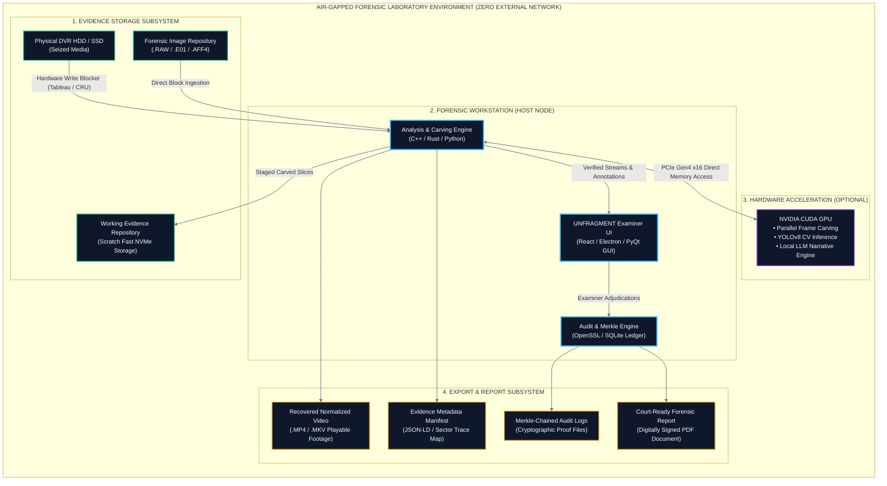
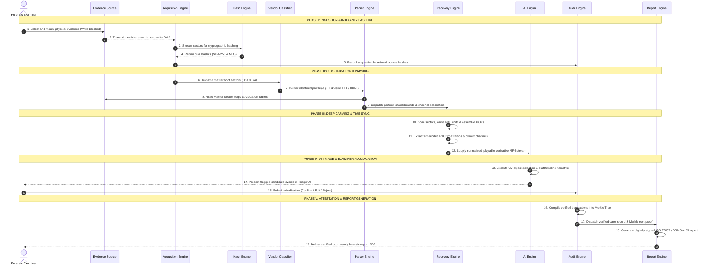

# 08 — Deployment, Hardware & Tech Stack
## Laboratory Topology, Component Interaction Sequence & Engineering Stack

---

## 💡 In Plain English / For Non-Tech Readers: The Offline Forensic Lab

In spy movies, high-tech labs are always connected to satellites and the cloud. In real forensic science, **that is illegal**. 

If an evidence computer is connected to the internet:
* A hacker could delete the video remotely.
* Cloud services might upload confidential crime footage to external servers.
* Defense lawyers will ask: *"Did someone hack into your system while you were working?"*

UNFRAGMENT operates in an **Air-Gapped Workstation** (completely disconnected from Wi-Fi, Ethernet, and Bluetooth).

```
┌────────────────────────────────────────────────────────────────────────────────────────┐
│                     THE PHYSICAL FORENSIC WORKSTATION SETUP                            │
├────────────────────────────────────────────────────────────────────────────────────────┤
│                                                                                        │
│  ┌──────────────────────────────────────────────────────────────────────────────────┐  │
│  │ DUAL FORENSIC MONITORS                                                           │  │
│  │ ┌──────────────────────────────────────┐  ┌───────────────────────────────────┐  │  │
│  │ │ [16-Channel Video Player Canvas]     │  │ [Timeline Scrubber & AI Triage]   │  │  │
│  │ │ Cam 1, Cam 2, Cam 3... In lockstep!  │  │ Click timestamp to jump video!    │  │  │
│  │ └──────────────────────────────────────┘  └───────────────────────────────────┘  │  │
│  └────────────────────────────────────────┬─────────────────────────────────────────┘  │
│                                           │ DisplayPort                                │
│                                           ▼                                            │
│  ┌──────────────────────────────────────────────────────────────────────────────────┐  │
│  │ HIGH-PERFORMANCE FORENSIC WORKSTATION                                            │  │
│  │ • 16-Core CPU (Deep Frame Carving)                                               │  │
│  │ • 64 GB ECC RAM (High-Speed Memory Buffers)                                      │  │
│  │ • NVIDIA RTX GPU (Local AI Vision Inference)                                     │  │
│  │ • 4 TB NVMe Scratch Drive (Super-fast temporary video storage)                   │  │
│  │ • 🚫 NETWORK CARD DISABLED (AIR-GAPPED - ZERO CLOUD TELEMETRY!)                  │  │
│  └────────────────────────────────────────▲─────────────────────────────────────────┘  │
│                                           │ USB 3.0 / PCIe                             │
│                                           │ Direct Read-Only Channel                   │
│                                           ▼                                            │
│  ┌──────────────────────────────────────────────────────────────────────────────────┐  │
│  │ PHYSICAL HARDWARE WRITE BLOCKER (Tableau / CRU Bridge)                           │  │
│  │ [RED LIGHT: WRITE COMMANDS BLOCKED]   [GREEN LIGHT: POWER ON / READ-ONLY OK]     │  │
│  └────────────────────────────────────────▲─────────────────────────────────────────┘  │
│                                           │ SATA / SAS / NVMe Cable                    │
│                                           ▼                                            │
│  ┌──────────────────────────────────────────────────────────────────────────────────┐  │
│  │ SEIZED CRIME SCENE EVIDENCE (Proprietary Hikvision / Dahua Surveillance Drive)   │  │
│  └──────────────────────────────────────────────────────────────────────────────────┘  │
│                                                                                        │
└────────────────────────────────────────────────────────────────────────────────────────┘
```

---

## 🖥️ Air-Gapped Deployment Architecture (Mermaid)



---

## ⏱️ UML Sequence Diagram (System Call Flow)



---

## 🛠️ Technology Stack Architecture (Mermaid)

```mermaid
flowchart TD
    %% Styling Classes
    classDef stackUI fill:#0f172a,stroke:#38bdf8,stroke-width:2px,color:#f8fafc;
    classDef stackAI fill:#0f172a,stroke:#a855f7,stroke-width:2px,color:#f8fafc;
    classDef stackCore fill:#0f172a,stroke:#06b6d4,stroke-width:2px,color:#f8fafc;
    classDef stackSec fill:#0f172a,stroke:#10b981,stroke-width:2px,color:#f8fafc;
    classDef stackAcq fill:#0f172a,stroke:#f59e0b,stroke-width:2px,color:#f8fafc;

    subgraph STACK_UI ["USER INTERFACE & PRESENTATION TIER"]
        UI_FE["Modern Desktop / Web GUI<br/>(React 18 / TypeScript / Tailwind CSS / Electron)"]:::stackUI
        UI_VID["Multi-Channel Video Canvas<br/>(Video.js / HTML5 WebGL Hardware Canvas)"]:::stackUI
        UI_HEX["Forensic Hex & Sector Inspector<br/>(Custom High-Performance Virtualized Grid)"]:::stackUI
    end

    subgraph STACK_AI ["AI & COMPUTER VISION TIER"]
        AI_CV["Computer Vision Triage Engine<br/>(PyTorch / ONNX Runtime / YOLOv8-nano)"]:::stackAI
        AI_ML["Vendor / Codec ML Classifier<br/>(Scikit-learn / LightGBM Byte-Entropy Model)"]:::stackAI
        AI_LLM["Assisted Report Drafting<br/>(Local Quantized Llama-3-8B via llama.cpp)"]:::stackAI
    end

    subgraph STACK_CORE ["PARSING & RECONSTRUCTION TIER"]
        CORE_RUST["High-Performance Carving Engine<br/>(Rust / C++20 Memory-Safe Binary Parsers)"]:::stackCore
        CORE_PY["Format Discovery & Prototyping<br/>(Python 3.12 / Kaitai Struct / Construct)"]:::stackCore
        CORE_FF["Stream Remuxing & Video Transcoding<br/>(FFmpeg 6.x / libavcodec / libavformat)"]:::stackCore
    end

    subgraph STACK_SEC ["SECURITY & CRYPTOGRAPHIC TIER"]
        SEC_HASH["Dual Hashing & Verification<br/>(OpenSSL 3.x / Crypto++ SHA-256 & MD5)"]:::stackSec
        SEC_MERKLE["Tamper-Evident Event Ledger<br/>(Custom RFC 6962 Compliant Merkle Tree)"]:::stackSec
        SEC_SIG["Digital Signatures & Legal Packaging<br/>(libsodium Ed25519 / ReportLab PDF Engine)"]:::stackSec
    end

    subgraph STACK_ACQ ["ACQUISITION & LOW-LEVEL I/O TIER"]
        ACQ_RAW["Direct Sector Block I/O<br/>(Direct Win32 CreateFile / Linux O_DIRECT)"]:::stackAcq
        ACQ_IMG["Forensic Image Container Support<br/>(libewf for .E01 / libaff4 for .AFF4)"]:::stackAcq
        ACQ_HW["Hardware Write-Blocker Interface<br/>(Tableau / CRU / USB3-to-SATA Firmware Lock)"]:::stackAcq
    end

    STACK_UI --> STACK_AI
    STACK_AI --> STACK_CORE
    STACK_CORE --> STACK_SEC
    STACK_SEC --> STACK_ACQ

    linkStyle default stroke:#64748b,stroke-width:1.5px;
```



---

[← Previous: 07 — Integrity & Security](./07_INTEGRITY_SECURITY_AND_CHAIN_OF_CUSTODY.md) | [Master Index](./README.md) | [Next: 09 — Operations Matrix & Failure Handling →](./09_OPERATIONS_MATRIX_AND_FAILURE_HANDLING.md)
