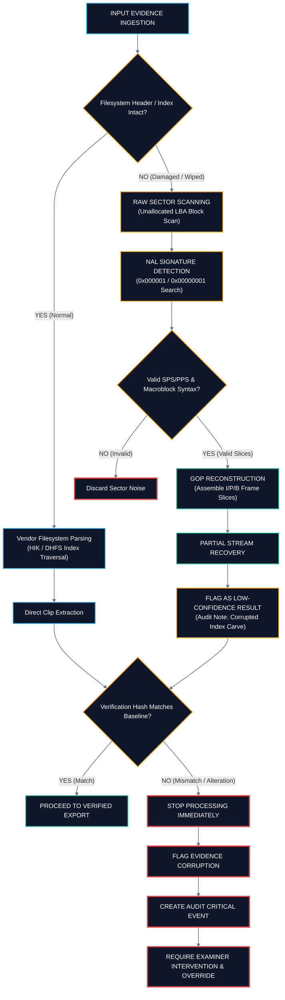
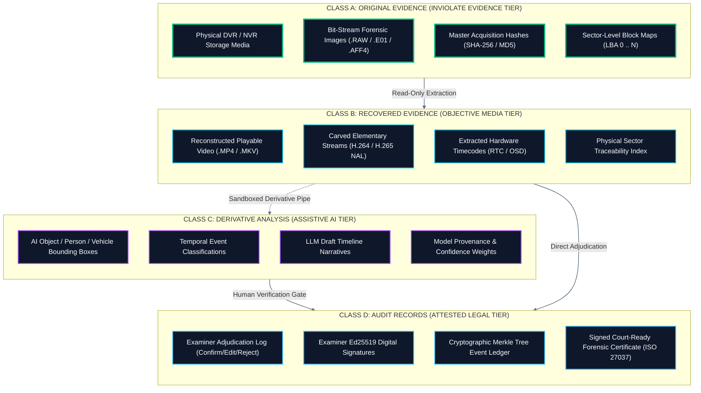

# 09 — Operations Matrix & Failure Handling
## Subsystem Responsibilities, Data Tiers & Edge-Case Failure Protocols

---

## 💡 In Plain English / For Non-Tech Readers: What Happens When a Disk is Damaged?

In real police investigations, evidence is rarely pristine. Criminals deliberately:
* Pull the plug while the DVR is recording.
* Press "Factory Reset" or "Format Disk".
* Drop the recorder in water or damage the disk partition table.

UNFRAGMENT has an **Automated Safety Valve System**:

```
┌────────────────────────────────────────────────────────────────────────────────────────┐
│                 WHAT HAPPENS WHEN EVIDENCE IS DAMAGED OR WIPED?                        │
├────────────────────────────────────────────────────────────────────────────────────────┤
│                                                                                        │
│                      [UNFRAGMENT INGESTS SEIZED DISK]                                  │
│                                     │                                                  │
│                                     ▼                                                  │
│                       IS DISK HEADER / INDEX INTACT?                                   │
│                        /                         \                                     │
│                  YES  /                           \  NO (Wiped / Formatted / Corrupt) │
│                      ▼                             ▼                                   │
│            [NORMAL FAST PATH]             [HEROIC CARVING FALLBACK]                    │
│            Read master index table        Search raw sectors for H.264/H.265           │
│            Instant video recovery!        magic codes (00 00 01). Assemble broken      │
│                                           frames into video slices.                    │
│                                                    │                                   │
│                                                    ▼                                   │
│                                           FLAG AS LOW-CONFIDENCE                       │
│                                           Notify detective: "Recovered from unallocated│
│                                           space without index."                        │
│                                                                                        │
│  ────────────────────────────────────────────────────────────────────────────────────  │
│                                                                                        │
│  WHAT IF SOMEONE TRIES TO TAMPER WITH OR ALTER EVIDENCE?                               │
│  ┌──────────────────────────────────────────────────────────────────────────────────┐  │
│  │ 🚨 HASH MISMATCH DETECTED!                                                       │  │
│  │ Calculated hash does not match crime scene baseline!                             │  │
│  │ 🛑 SYSTEM ACTION: Immediately halt all processes. Sound alarm. Lock interface.  │  │
│  │ 📋 AUDIT ACTION: Record tamper event in Merkle ledger. Require human explanation.│  │
│  └──────────────────────────────────────────────────────────────────────────────────┘  │
│                                                                                        │
└────────────────────────────────────────────────────────────────────────────────────────┘
```

---

## ⚠️ Failure Recovery Workflow Diagram (Mermaid)



---

## 📊 Component Responsibility Matrix

| Subsystem | Core Mission | What Goes In (Input) | What Comes Out (Output) | Failure & Safety Behavior |
| :--- | :--- | :--- | :--- | :--- |
| **Acquisition Engine** | Read-only physical drive imaging | Physical DVR HDD/SSD | Raw byte bitstream (.RAW / .E01) | Aborts instantly if write signal detected. |
| **Hash Engine** | Cryptographic integrity | Raw bitstream | SHA-256 & MD5 values | Raises critical alarm on hash mismatch. |
| **Vendor Classifier** | Identifies CCTV brand | Boot sectors (LBA 0..64) | Vendor profile & confidence score | Prompts examiner if confidence is low (< 70%). |
| **Parser Engine** | Decodes proprietary structures | Raw disk image & vendor profile | Master sector map & channel list | Falls back to raw carving if tables are wiped. |
| **Recovery Engine** | Hunts video in unallocated space | Unallocated disk sectors | Raw H.264/H.265 frame slices | Drops corrupted noise bytes automatically. |
| **Time Sync Engine** | Syncs multi-camera clocks | Slice headers (HKMI/DHAV) | Master UTC timecode track | Interpolates timestamps if clock header corrupt. |
| **AI Engine** | Local video triage & drafting | Recovered MP4 copy | Clickable detections & draft report | Watermarks everything as provisional. |
| **Examiner UI** | Command center & verification | Playable video & AI annotations | Human Confirm/Edit/Reject decisions | Blocks unreviewed AI from case reports. |
| **Audit Engine** | Unhackable event recording | All user & system events | Merkle-tree chained receipts | Rejects backdated or unsigned entries. |
| **Report Engine** | Court-ready certification | Verified findings & Merkle root | Signed legal PDF certificate | Validates all signatures before rendering. |

---

## 🏷️ The Four Data Classification Tiers



---

[← Previous: 08 — Deployment & Hardware](./08_DEPLOYMENT_HARDWARE_AND_TECH_STACK.md) | [Master Index](./README.md) | [Next: 10 — Future Roadmap & Summary →](./10_FUTURE_ROADMAP_AND_SUMMARY.md)
