# 10 — Future Roadmap & Architecture Summary
## Extensibility Design, Hackathon Scope Disclosure & Final Architectural Synthesis

---

## 💡 In Plain English / For Non-Tech Readers: Building for the Future

No single software team can reverse-engineer all 50+ camera brands in the world in a single hackathon. Anyone claiming they have fully cracked every single DVR in 36 hours is not telling the truth.

UNFRAGMENT takes an **honest, enterprise-grade engineering approach**:
1. **Working & Demonstrated Today:** Hikvision native parsing, deep raw H.264/H.265 NAL carving, on-device YOLOv8 AI triage, and Merkle-tree cryptographic audit chaining are fully built and working.
2. **Modular Plugin Sockets Ready:** We built standard "docking bays" (APIs). When police departments encounter new camera brands (like Uniview, CP Plus, TVT, or Tiandy), new plugins plug right into UNFRAGMENT without rewriting any core code.

```
┌────────────────────────────────────────────────────────────────────────────────────────┐
│                        UNFRAGMENT MODULAR EXTENSIBILITY BLUEPRINT                      │
├────────────────────────────────────────────────────────────────────────────────────────┤
│                                                                                        │
│                             ┌────────────────────────────┐                             │
│                             │   UNFRAGMENT CORE ENGINE   │                             │
│                             │ (Write-Block, Carve, Hash) │                             │
│                             └──────────────┬─────────────┘                             │
│                                            │                                           │
│                    ┌───────────────────────┴───────────────────────┐                   │
│                    │                                               │                   │
│                    ▼                                               ▼                   │
│        [VENDOR PLUGIN INTERFACE]                       [AI MODEL PLUGIN INTERFACE]     │
│        ┌────────────────────────┐                      ┌────────────────────────┐      │
│        │ ✅ HIKVISION (WORKING) │                      │ ✅ YOLOv8 OBJECT/CAR   │      │
│        ├────────────────────────┤                      ├────────────────────────┤      │
│        │ 🔄 DAHUA (STUB READY)  │                      │ 🔮 VIDEO TAMPER/FORGERY│      │
│        ├────────────────────────┤                      ├────────────────────────┤      │
│        │ 🔮 JOVISION (STUB)     │                      │ 🔮 LICENSE PLATE (LPR) │      │
│        ├────────────────────────┤                      ├────────────────────────┤      │
│        │ 🔮 UNIVIEW / CP PLUS   │                      │ 🔮 FACIAL RE-ID ACROSS │      │
│        │    (ROADMAP PLUGINS)   │                      │    MULTIPLE CAMERAS    │      │
│        └────────────────────────┘                      └────────────────────────┘      │
│                                                                                        │
└────────────────────────────────────────────────────────────────────────────────────────┘
```

---

## 🚀 Future Extensibility Architecture (Mermaid)

```mermaid
flowchart TD
    %% Styling Classes
    classDef coreBase fill:#0f172a,stroke:#38bdf8,stroke-width:3px,color:#f8fafc;
    classDef sdkBase fill:#0f172a,stroke:#a855f7,stroke-width:2px,color:#f8fafc;
    classDef currPlug fill:#0f172a,stroke:#10b981,stroke-width:2px,color:#f8fafc;
    classDef futPlug fill:#0f172a,stroke:#64748b,stroke-dasharray: 5 5,stroke-width:2px,color:#94a3b8;

    subgraph CORE_SYS ["UNFRAGMENT PLATFORM CORE"]
        UF_CORE["UNFRAGMENT FORENSIC CORE ENGINE"]:::coreBase
    end

    subgraph SDK_LAYER ["STANDARDIZED PLUGIN EXTENSION INTERFACES"]
        SDK_PARSER["VENDOR PARSER PLUGIN SDK<br/>(BaseParser C-ABI / Python ABC)"]:::sdkBase
        SDK_AI["AI MODEL PLUGIN SDK<br/>(ONNX Runtime Model Interface)"]:::sdkBase
    end

    subgraph VENDOR_EXPANSION ["VENDOR FORMAT PLUGINS"]
        V_HIK["Hikvision Plugin<br/>(DEMO COMPLETED)"]:::currPlug
        V_DAH["Dahua DHFS Plugin<br/>(FUTURE / EXTENSIBLE)"]:::futPlug
        V_JOV["Jovision WFS Plugin<br/>(FUTURE / EXTENSIBLE)"]:::futPlug
        V_UNI["Uniview U-FS Plugin<br/>(FUTURE / EXTENSIBLE)"]:::futPlug
        V_CPP["CP Plus Custom Plugin<br/>(FUTURE / EXTENSIBLE)"]:::futPlug
        V_OTH["Generic Proprietary DVRs<br/>(FUTURE / EXTENSIBLE)"]:::futPlug
    end

    subgraph AI_EXPANSION ["SPECIALIZED FORENSIC AI DETECTORS"]
        A_OBJ["Object / Person / Vehicle<br/>(DEMO COMPLETED)"]:::currPlug
        A_ANOM["Tamper / Splice Detection<br/>(FUTURE / EXTENSIBLE)"]:::futPlug
        A_FOR["Video Compression Artifact Forgery<br/>(FUTURE / EXTENSIBLE)"]:::futPlug
        A_LPR["Automated License Plate Recognition<br/>(FUTURE / EXTENSIBLE)"]:::futPlug
        A_GEO["Cross-Camera Re-Identification<br/>(FUTURE / EXTENSIBLE)"]:::futPlug
    end

    UF_CORE --> SDK_PARSER
    UF_CORE --> SDK_AI

    SDK_PARSER --> V_HIK
    SDK_PARSER -.-> V_DAH
    SDK_PARSER -.-> V_JOV
    SDK_PARSER -.-> V_UNI
    SDK_PARSER -.-> V_CPP
    SDK_PARSER -.-> V_OTH

    SDK_AI --> A_OBJ
    SDK_AI -.-> A_ANOM
    SDK_AI -.-> A_FOR
    SDK_AI -.-> A_LPR
    SDK_AI -.-> A_GEO

    linkStyle default stroke:#64748b,stroke-width:1.5px;
```



---

## 🏛️ Final Architecture Summary

```
┌────────────────────────────────────────────────────────────────────────────────────────┐
│                                   FORENSIC EXAMINER                                    │
│                     Review • Verify • Adjudicate • Investigate                         │
└───────────────────────────────────────────┬────────────────────────────────────────────┘
                                            │
                                            ▼
┌────────────────────────────────────────────────────────────────────────────────────────┐
│                        LAYER 4: EXAMINER UI & AUDITING LAYER                           │
│       Multi-Channel Viewer • Timeline • Hex Inspector • Merkle Chain • PDF Reports     │
└───────────────────────────────────────────┬────────────────────────────────────────────┘
                                            │
                                            ▼
┌────────────────────────────────────────────────────────────────────────────────────────┐
│                            LAYER 3: AI INTELLIGENCE LAYER                              │
│       Vendor Fingerprinting • CV Triage • Timeline Intelligence • Narrative Drafter    │
└───────────────────────────────────────────┬────────────────────────────────────────────┘
                                            │
                                            ▼
┌────────────────────────────────────────────────────────────────────────────────────────┐
│                        LAYER 2: PARSING & RECOVERY LAYER                               │
│      Vendor Filesystems (HIK/DHFS) • NAL Carver • GOP Reconstructor • RTC Time Sync    │
└───────────────────────────────────────────┬────────────────────────────────────────────┘
                                            │
                                            ▼
┌────────────────────────────────────────────────────────────────────────────────────────┐
│                         LAYER 1: ACQUISITION & I/O LAYER                               │
│        Hardware Write Blocker • Direct DMA Imager • Dual SHA-256/MD5 Hash Engine       │
└───────────────────────────────────────────┬────────────────────────────────────────────┘
                                            │
                                            ▼
┌────────────────────────────────────────────────────────────────────────────────────────┐
│                               PHYSICAL EVIDENCE SUBSTRATE                              │
│              Proprietary CCTV DVR / NVR Storage • Surveillance HDD / SSD               │
└────────────────────────────────────────────────────────────────────────────────────────┘
```

---

## 🛡️ The Final Architectural Affirmation

> [!IMPORTANT]
> **THE CENTRAL GOVERNING PRINCIPLE OF UNFRAGMENT**  
> **UNFRAGMENT converts proprietary DVR/NVR storage into verified, reviewable forensic evidence while preserving the absolute integrity of the original evidence and keeping AI analysis separately auditable.**

---

[← Previous: 09 — Operations Matrix](./09_OPERATIONS_MATRIX_AND_FAILURE_HANDLING.md) | [Master Index](./README.md)
